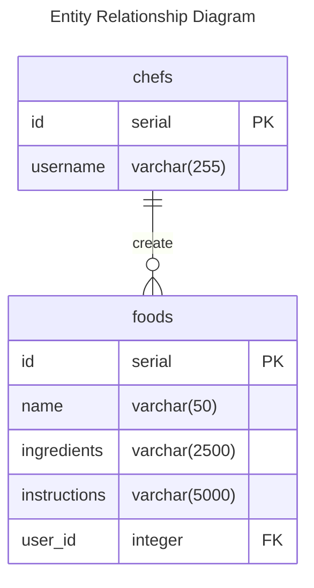

One chef creates many food items to be viewed by all other chefs

Foods may be in the database many times, as chefs make them differently

```mermaid
---
title: Entity Relationship Diagram
---
erDiagram
    chefs {
        id serial PK
        username varchar(255)
    }
    foods {
        id serial PK
        name varchar(50)
        ingredients varchar(2500)
        instructions varchar(5000)
        user_id integer FK
    }

    chefs ||--o{ foods : create
```
