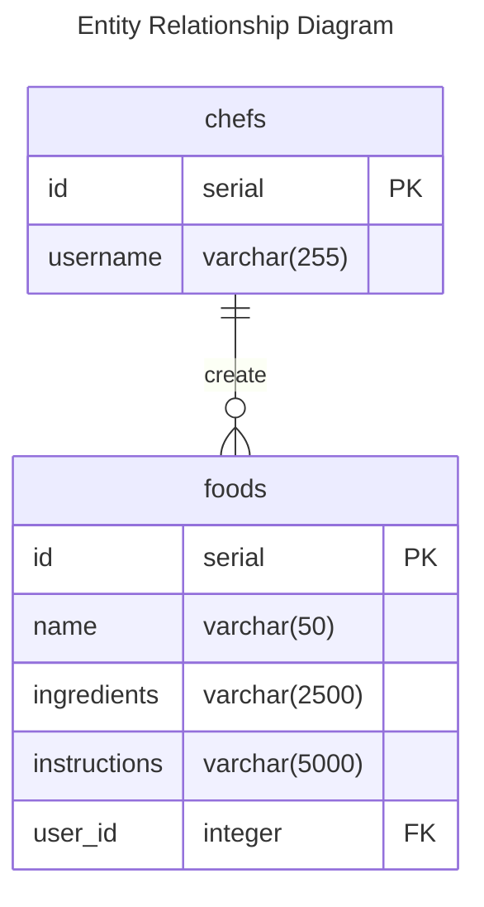

One chef creates many food items to be viewed by all other chefs

Foods may be in the database many times, as chefs make them differently

TO RUN

1. npm install
2. change .env.template to .env
3. change .env data to your needs and use case
    3a- Port and DBURL should both be strings. DBURL should end in ?ssl=true
4. run init.sql in your db
5.

helpful links
https://expressjs.com/en/starter/hello-world.html
    - express docs
https://node-postgres.com/
    - node pg docs
https://dashboard.render.com
    - db and website deployemnt

