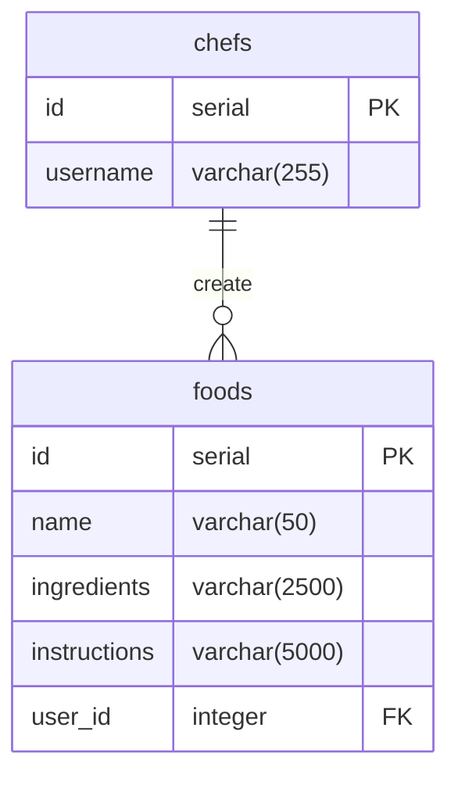

# Chefs Delight - CRUD Application

## Table of Contents
1. [Introduction](#introduction)
2. [Getting Started](#getting-started)
3. [Usage](#usage)
4. [Dependencies](#dependencies)
5. [Helpful Links](#helpful-links)
6. [Entity Relationship Diagram](#entity-relationship-diagram)

## Introduction 
Chefs Delight is a simple CRUD (Create, Read, Update, Delete) application built using Node.js, Express, and PostgreSQL. This application allows you to manage a list of chefs and their associated recipes.


## Getting Started

To run the application, follow these steps:

```bash
npm install
```

Rename ```.env.template``` to ```.env``` and update the data in the file according to your needs and use case. Make sure to set PORT and DBURL as strings, where DBURL should end in ?ssl=true.

```bash
node server.js
```

## Usage

The application provides a web interface to perform CRUD operations on chefs and their recipes. Use the provided buttons (CREATE, READ, UPDATE, DELETE) to interact with the data. Input fields are available for providing necessary information.

## Dependencies
- Express: Fast, unopinionated, minimalist web framework for Node.js.
- Node.js: JavaScript runtime built on Chrome's V8 JavaScript engine.
- PostgreSQL: Powerful, open-source object-relational database system.
- jQuery: Fast, small, and feature-rich JavaScript library.

## Helpful Links
[Express.js Documentation](https://expressjs.com/en/starter/hello-world.html)

[Node.js Documentation](https://node-postgres.com/)

[jQuery Documentation](https://api.jquery.com/jQuery.ajax/#jQuery-ajax-settings-settings)

[Free Website and Database Deployment](https://dashboard.render.com/)

[Kill all node processes](https://stackoverflow.com/questions/31649267/how-to-kill-a-nodejs-process-in-linux
)
## Entity Relationship Diagram




